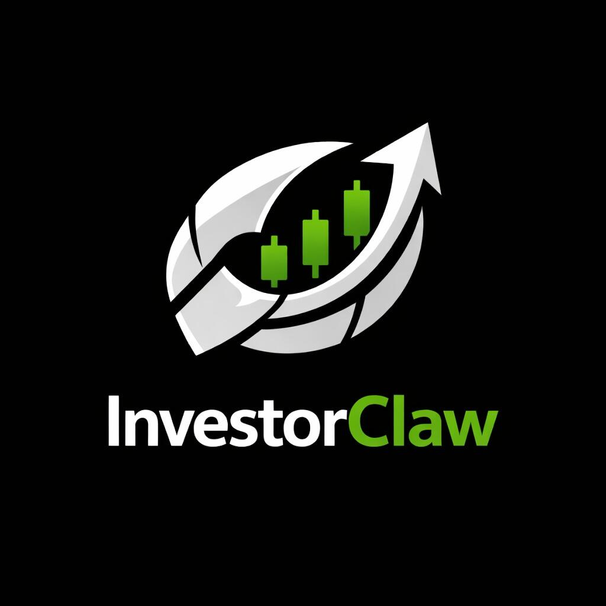
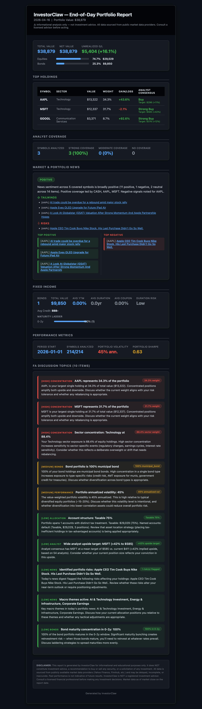

# InvestorClaw

<p align="center">
  <picture>
    <source srcset="assets/investorclaw-logo.webp" type="image/webp">
    
  </picture>
</p>

<p align="center">
Portfolio analysis and market intelligence | v4.1.34 | Apache 2.0 + MIT-0 | Educational Use Only
</p>

InvestorClaw is a self-contained containerized software package that any MCP-capable agent calls into. It is not a markdown skill. It is not a prompt injection. It is the adapter and distribution layer for a real portfolio engine, packaged for agent runtimes that know how to speak MCP.

The deterministic engine lives in [`ic-engine`](https://github.com/argonautsystems/ic-engine). Foundation primitives live in [`clio`](https://github.com/argonautsystems/clio). The runtime container lives in [`mnemos-ic-runtime`](https://github.com/mnemos-os/mnemos-ic-runtime).

Optional [Stonkmode](docs/STONKMODE_AVATAR_LEGEND.md) adds live commentary from 30 fictional cable TV finance personalities. It is entertainment and education on top of the portfolio surface, not a requirement.

---

## Features

InvestorClaw separates agent-facing commands from portfolio computation.

- Containerized engine. The current runtime is a single Docker container with MCP-HTTP on port `18090` and the dashboard portal on port `18092`. Start the container, point an MCP-capable agent at it, and ask portfolio questions.
- Deterministic computation. There is no LLM in the parse path. Holdings parsing, normalization, analytics, and envelopes are deterministic. Narration is optional, provider-swappable, and sits on top of structured output.
- Six asset classes. InvestorClaw handles equities, bonds, ETFs, mutual funds, options, and cash.
- Thirteen MCP tools. The live surface is `portfolio_ask`, `portfolio_initialize`, `portfolio_initialize_status`, `portfolio_holdings`, `portfolio_refresh`, `portfolio_setup`, `portfolio_keys_status`, `portfolio_keys_set`, `portfolio_keys_delete`, `portfolio_response_get`, `portfolio_response_list`, `portfolio_response_delete`, and `portfolio_response_flag_bad`.
- 17-tab dashboard portal. Open `http://localhost:18092` for Overview, Holdings, Performance, WhatChanged, Scenarios, Bonds, Optimize, Cashflow, Peer, Analyst, News, Markets, Lookup, Synthesis, Reports, Settings, and About.
- Regenerate from the browser. The Overview tab has a Regenerate button that fires setup, refresh, and all 12 analyzers as a background sweep.
- Web upload form. Settings accepts multipart uploads for `.csv`, `.tsv`, `.xls`, `.xlsx`, `.pdf`, `.json`, `.ofx`, and `.qfx` portfolio files.
- Pluggable narrative providers. The default narration stack is Together AI with `MiniMaxAI/MiniMax-M2.7`. Swap it for any OpenAI-compatible endpoint if your runtime or policy wants something else.
- Safe fallback defaults. InvestorClaw can start with no API keys and use the `yfinance` fallback. Optional keys improve news, ratings, and premium data coverage.
- HMAC-signed envelopes. Outputs are tamper-evident. They are not encrypted.
- No fabrication path. The engine returns what it can prove from data, marks gaps, and avoids pretending that missing facts exist.
- No brokerage credentials. InvestorClaw does not ask for brokerage logins and does not need them.
- No outbound trades. This package analyzes portfolios. It never places orders.
- Cobol NLQ barrage coverage. The 30-prompt natural-language query barrage in `harness/cobol/nlq-prompts.json` currently stands at 29/30 PASS.

Native cross-runtime coverage varies.

See [docs/AGENT-COMPARISON.md](docs/AGENT-COMPARISON.md) *(coming soon)* for the per-runtime provider matrix.

> Note: Effective April 4, 2026, Anthropic Claude subscriptions (Pro at $20/mo and Max at $100–$200/mo) no longer cover use from third-party agent runtimes like OpenClaw, ZeroClaw, or Hermes Agent. The plan limits do not apply there, and a subscription alone will not authenticate those calls.
>
> To use Claude models from a third-party agent, either enable pay-as-you-go "extra usage" billing on the subscription or connect with a direct API key on metered billing.
>
> Claude Code is different. Anthropic subscriptions continue to apply normally there at standard rates.
>
> The fleet default stack for non-Claude-Code runtimes is therefore MiniMax-via-Together for narrative and Gemma4 for consultation. Use Claude Code if you want Claude.
>
> Sources: [PYMNTS 2026-04-04](https://www.pymnts.com/artificial-intelligence-2/2026/third-party-agents-lose-access-as-anthropic-tightens-claude-usage-rules/), [VentureBeat](https://venturebeat.com/technology/anthropic-cuts-off-the-ability-to-use-claude-subscriptions-with-openclaw-and)

---

## Non-Goals

InvestorClaw helps you have informed conversations with your financial advisor by surfacing data-driven insights. It does not manage money. It does not execute trades. It does not provide investment advice.

---

## Comparison With thinkorswim

InvestorClaw helps you understand your portfolio. thinkorswim helps you execute trades.

|  | InvestorClaw | thinkorswim |
|---|---|---|
| Purpose | Portfolio analysis & insights | Active trading & execution |
| Can trade? | ❌ No | ✅ Yes |
| Data source | Free (yfinance) + optional paid (Massive, Finnhub) | Real-time (proprietary) |
| Run locally? | ✅ Yes (Docker / yfinance fallback) | ❌ Cloud only |
| Open source? | ✅ Yes (Apache 2.0) | ❌ Proprietary |
| Target user | Individual investors + advisors | Professional/active traders |
| Best for | Understanding your portfolio | Executing trades + charting |

Use InvestorClaw to analyze.

Use thinkorswim to execute.

Use both if you want analysis and execution in one workflow.

---

## Quick Start

InvestorClaw supports Claws-family, Claude Code, Hermes Agent, and standalone Docker Compose deployment paths.

Choose the platform that matches how you work.

### Claude Code

Claude Code support lives in the separate InvestorClaude plugin. Anthropic marketplace acceptance is pending, so use the GitLab path for now.

```text
/plugin marketplace add https://gitlab.com/argonautsystems/InvestorClaude.git
/plugin install investorclaw@investorclaude
```

First question:

```text
What are my current holdings?
```

Do not clone the repo.

Do not run Python package installers for Claude Code.

The plugin discovers its commands from InvestorClaude, and that plugin prepares its local runtime when first used.

---

### OpenClaw

OpenClaw fits Linux and macOS workstations and servers.

Install InvestorClaw as an OpenClaw skill:

```bash
clawhub install perlowja/investorclaw
```

First question:

```text
Run a full portfolio analysis.
```

---

### ZeroClaw

ZeroClaw fits Raspberry Pi and other ARM devices.

Install InvestorClaw:

```bash
clawhub install perlowja/investorclaw
```

First question:

```text
What's my bond allocation?
```

---

### Hermes Agent

Hermes Agent installs InvestorClaw inside the NousResearch agentic CLI.

Hermes Agent is the agentic CLI.

It is not a model.

You can pair it with any provider the agent supports. That includes cloud providers such as OpenAI, Together, xAI, OpenRouter, and Nous Portal. It also includes fully local providers such as Ollama, vLLM, llama-server, and LMStudio.

> Note: The Hermes LLM family (Hermes 3, Hermes 4 - NousResearch fine-tunes of Llama/Qwen) is a separate product. Hermes Agent can use a Hermes LLM as its backend model, or any other model.

```bash
clawhub install perlowja/investorclaw
```

First question:

```text
Summarize my portfolio performance.
```

---

### Standalone Docker Compose

Use the runtime container directly when you want InvestorClaw without an agent-specific installer.

Runtime source: [`mnemos-os/mnemos-ic-runtime`](https://github.com/mnemos-os/mnemos-ic-runtime).

```bash
docker compose up -d
```

Dashboard: `http://localhost:18092`.

Then connect any MCP client to:

```text
http://localhost:18090/mcp
```

First question to agent:

```text
List available portfolio tools.
```

---

## Dashboard / Web Portal

The local dashboard runs at `http://localhost:18092`.

It is the browser surface for people who want to inspect the portfolio, upload files, regenerate analytics, manage provider keys, and read saved reports without turning every action into a chat prompt.

| Tab | What it shows |
|---|---|
| Overview | Live portfolio snapshot plus the Regenerate button, which triggers the full 12-analyzer sweep |
| Holdings | Position-level detail with cost basis, market value, and gain/loss |
| Performance | Time-series return charts, alpha, beta, and Sharpe |
| WhatChanged | Delta view between the last two refreshes |
| Scenarios | What-if analysis for allocation shifts |
| Bonds | Duration, yield, and credit quality breakdown |
| Optimize | Mean-variance and risk-parity weight suggestions |
| Cashflow | Dividend and coupon income calendar |
| Peer | Relative performance vs benchmark and peer basket |
| Analyst | Wall Street consensus estimates and ratings |
| News | Recent headlines filtered to portfolio constituents |
| Markets | Broad market context across indices, sectors, and macro |
| Lookup | Symbol search and quick quote |
| Synthesis | Narrative summary generated by the configured LLM provider |
| Reports | Saved HTML reports and EOD email archives |
| Settings | API key management, portfolio file upload, and provider config |
| About | Version, license, and build info |

The Regenerate button on Overview fires setup, refresh, and all 12 analyzers as a background sweep. Results normally become visible in Overview within about 60 seconds.

The upload form on Settings sends a multipart POST and accepts `.csv`, `.tsv`, `.xls`, `.xlsx`, `.pdf`, `.json`, `.ofx`, and `.qfx` files.

---

## Commands / MCP Tools

See [docs/MCP_TOOLS_REFERENCE.md](docs/MCP_TOOLS_REFERENCE.md) for the full command contract.

| Tool | Purpose |
|---|---|
| portfolio_ask | Natural-language query against current portfolio data |
| portfolio_initialize | Seed the engine with uploaded holdings |
| portfolio_initialize_status | Poll initialization progress |
| portfolio_holdings | Return current holdings envelope |
| portfolio_refresh | Re-run all 12 analyzers |
| portfolio_setup | One-shot setup from raw file |
| portfolio_keys_status | Check which provider API keys are configured |
| portfolio_keys_set | Set a named provider API key |
| portfolio_keys_delete | Delete a named provider API key |
| portfolio_response_get | Retrieve a saved response by ID |
| portfolio_response_list | List saved responses |
| portfolio_response_delete | Delete a saved response |
| portfolio_response_flag_bad | Flag a response as low quality (feedback loop) |

---

## EOD Report

Ask InvestorClaw to generate an HTML email report that summarizes your portfolio at end of day.

<p align="center">
  <picture>
    <source srcset="assets/eod-report-sample.webp" type="image/webp">
    
  </picture>
</p>

```text
investorclaw ask "Generate my end-of-day portfolio report"
investorclaw ask "Generate my end-of-day report and email it to you@example.com"
```

For direct engine use inside the v4.x container, run:

```bash
docker exec ic-engine investorclaw eod-report --email-to address@example.com
```

A live HTML preview is also available at `http://localhost:18092/reports/eod_report_<YYYYMMDD>.html` once the daily run finishes. A static sample of the rendered report ships at [`assets/eod-report-sample.html`](assets/eod-report-sample.html) — open it in a browser to see the layout without running a portfolio first.

The report includes:

- Real-time prices and net values
- Performance metrics (Sharpe, Sortino, max drawdown, beta, VaR, period returns)
- Sector + asset-class allocation
- Per-symbol news sentiment with clickable headlines
- Fixed income detail (YTM, duration, maturity ladder, coupon schedule)
- 10 FA Discussion Topics (concentration risk, sector exposure, allocation drift, tax efficiency, news catalysts) with severity flags
- Email-ready HTML with a dark theme
- Mobile-responsive layout

Run it daily with cron if you want the institutional-grade HTML email waiting after market close.

Example cron pattern:

```cron
0 17 * * 1-5 investorclaw eod-report --email-to address@example.com
```

Set the usual SMTP environment variables for delivery, including `SMTP_HOST`, `SMTP_PORT`, `SMTP_USERNAME`, `SMTP_PASSWORD`, `SMTP_FROM`, and `SMTP_TLS`.

---

## Documentation

InvestorClaw runs as a containerized MCP package for multiple agent runtimes. Claude Code support is maintained in the split InvestorClaude plugin.

Use the Quick Start section to choose a path.

[docs/blog/we-stopped-fighting-the-agents.md](docs/blog/we-stopped-fighting-the-agents.md) — Draft TechBroiler sequel: determinism wasn't enough, we stopped fighting the agents and pulled the skill into its own container.

### Supported Agent Runtimes

| Page | What's there |
|------|--------------|
| [docs/AGENT-COMPARISON.md](docs/AGENT-COMPARISON.md) *(coming soon)* | Claude Code vs. OpenClaw vs. ZeroClaw vs. Hermes Agent |

### Claude Code and Claude API

| Page | What's there |
|------|--------------|
| [docs/CLAUDE_CODE.md](docs/CLAUDE_CODE.md) *(coming soon)* | Claude Code install path, Claude API notes, and InvestorClaude handoff |

### OpenClaw, ZeroClaw, and Hermes Agent

| Page | What's there |
|------|--------------|
| [docs/CLAWS_SETUP.md](docs/CLAWS_SETUP.md) *(coming soon)* | OpenClaw, ZeroClaw, and Hermes Agent setup notes |

### Shared Claw Architecture

| Page | What's there |
|------|--------------|
| [docs/CLAW_ARCHITECTURE.md](docs/CLAW_ARCHITECTURE.md) *(coming soon)* | Shared patterns across Claw-family runtimes |

### Commands and Features

| Page | What's there |
|------|--------------|
| [docs/DASHBOARD.md](docs/DASHBOARD.md) | Dashboard portal reference for the 17-tab localhost web UI |
| [docs/MCP_TOOLS_REFERENCE.md](docs/MCP_TOOLS_REFERENCE.md) | MCP tool names, request shapes, and response contracts |

### Architecture and Design

| Page | What's there |
|------|--------------|
| [docs/ARCHITECTURE.md](docs/ARCHITECTURE.md) *(coming soon)* | Container, engine, dashboard, and adapter design |

### Deployment and Operations

| Page | What's there |
|------|--------------|
| [docs/DEPLOYMENT.md](docs/DEPLOYMENT.md) *(coming soon)* | Docker Compose, runtime operations, and production notes |

### Security and Privacy

| Page | What's there |
|------|--------------|
| [docs/SECURITY.md](docs/SECURITY.md) *(coming soon)* | Localhost-first defaults, key handling, and privacy model |

---

## Security and Privacy

InvestorClaw is localhost-first.

The engine is read-only. It analyzes portfolio files and market data, but it does not accept brokerage credentials and does not execute trades.

The container runs as a non-root user (`uid 1000`).

Provider keys live in `/data/keys.env` inside the container with mode `0600`.

Output envelopes are HMAC-signed so callers can detect tampering. HMAC signatures are not encryption.

InvestorClaw has no telemetry and no analytics.

---

## License

Substantive code is Apache 2.0. That includes the bridge, dashboard, Dockerfile, tests, and engine work in [`argonautsystems/ic-engine`](https://github.com/argonautsystems/ic-engine).

Distribution-edge artifacts are MIT-0. That includes `SKILL.md`, `compose.yml`, `install.yaml`, and `agent-skills/**`.

See [LICENSE](LICENSE) for full Apache 2.0 terms.

---

Author: Jason Perlow | Questions? [Open an issue on GitHub](https://github.com/argonautsystems/InvestorClaw/issues)

v4.1.34 | Apache 2.0 + MIT-0 | Educational Use Only
