# Stonkmode — Entertainment Mode + Dr. Stonk Financial Education

**30 fictional cable TV finance personalities + educational mode**

<p align="center">
  <picture>
    <source srcset="../assets/stonkmode-banner.webp" type="image/webp">
    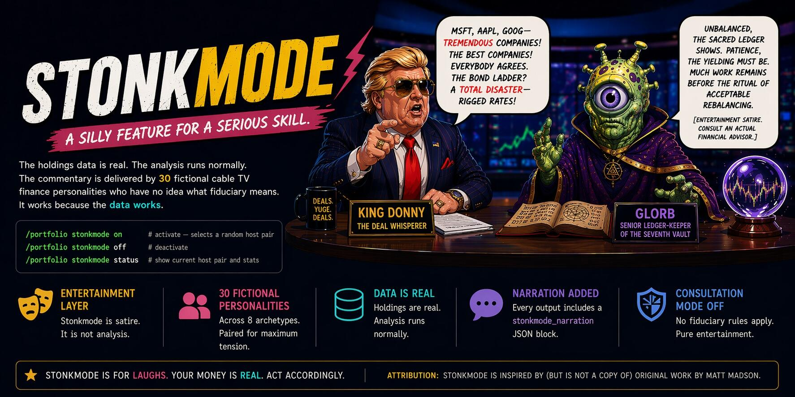
  </picture>
</p>

> **A silly feature for a serious skill — and that's the point.** The holdings data is real. The analysis runs normally. The commentary is delivered by 30 fictional cable TV finance personalities who have no idea what fiduciary means. It works because the data works.

---

## What is Stonkmode?

After serious portfolio analysis, enable **Stonkmode** for AI-generated
narrative commentary featuring 30 distinct fictional cable finance TV
personalities. Each persona has a unique voice, perspective, and comedic
flair, turning dry financial metrics into entertaining portfolio narratives.

**Stonkmode is entertainment, not advice.** Its existence is the clearest
signal that InvestorClaw is NOT institutional financial software. The math
underneath stays deterministic; the narration is the part wearing a loud tie.

> Stonkmode is an entertainment-layer toggle, but its existence is also a deliberate positioning statement: a tool that ships with 30 satirical cable TV personalities cannot credibly be mistaken for institutional financial software. If you are looking for a Bloomberg terminal or a fiduciary-grade advisory system, this is not it. InvestorClaw computes indicators and surfaces issues for discussion with your human financial advisor — stonkmode makes that boundary impossible to miss.

In v4.x, Stonkmode runs through the containerized ic-engine flow. The portal
is available at `localhost:18092`, and narrated results appear in the
Synthesis tab when Stonkmode is enabled.

---

## Enable Stonkmode

Use the agent flow instead of legacy slash commands:

```text
User says: "Switch to stonkmode."
User says: "What's in my portfolio?"
```

The agent routes the request through the `portfolio_ask` MCP tool. The engine
flips state in `~/.investorclaw/stonkmode.json`, mounted inside the container
as `/data/stonkmode.json`. Subsequent `portfolio_ask` calls return
character-narrated responses while the deterministic engine output remains
unchanged underneath.

To disable:

```text
User says: "Switch to normal mode."
```

That uses the same `portfolio_ask` flow and clears the narration toggle for
subsequent calls.

The old v2.x slash commands (`/portfolio stonkmode on`,
`/portfolio stonkmode off`, and `/portfolio stonkmode status`) are deprecated.
The engine still recognizes them for compatibility, but the canonical surface
is the agent's `portfolio_ask` route via MCP.

Stonkmode wraps analysis output in character narration while preserving all
underlying financial rigor. All math stays deterministic Python. The LLM only
generates the entertaining framing.

---

## Output Contract

When active, Stonkmode appends a `stonkmode_narration` JSON block to the
portfolio result. That block is intentionally labeled as entertainment so no
one mistakes King Donny or Glorb for a fiduciary with a compliance department.

Required fields:

- `consultation_mode: "deactivated"` — HMAC, fingerprint, and
  `synthesis_basis` rules do **not** apply when Stonkmode is on
- `is_entertainment: true`
- `is_satire: true`
- `is_investment_advice: false`
- `satire_disclaimer` — in-character disclaimer woven into the foil's final
  paragraph

The deterministic portfolio payload remains the data source underneath the
show. The `stonkmode_narration` block is presentation-layer metadata plus
character prose, not a signed advisory artifact.

---

## The 30 Personas

Stonkmode features 30 distinct fictional cable finance TV personalities
organized in the gallery below.

The roster is intentionally broad: bulls, bears, policy explainers, technical
pattern obsessives, crypto maximalists, cash-flow scolds, mystical ledger
keepers, and one monarch who treats unrealized gains like a treaty
negotiation. That range matters. Stonkmode is funnier when the same portfolio
can be interpreted by a disciplined risk officer, a viral-market hype machine,
and a vault clerk who believes concentration risk angers the ancestors.

The bit works only because the characters are attached to real engine output.
They can argue about MSFT concentration, bond ladders, analyst consensus, or
sector exposure. They cannot quietly replace the holdings table with fan
fiction and call it alpha.

---

### Character Gallery

See [STONKMODE_AVATAR_LEGEND.md](STONKMODE_AVATAR_LEGEND.md) for the full
avatar legend.


---

### Dr. Stonk — The 31st Persona

<p align="center">
  
</p>

**From the planet Hephaestus, Dr. Stonk is here for your logical financial
education.** *Logic. Data. Discipline. That's how we grow.*

Dr. Stonk is the 31st persona: not another market host, but an educator mode
that explains financial concepts without pretending to be a fiduciary, a
robo-advisor, or a crystal ball with better branding.

---

### Avatar Assets

- **Container path**: `/opt/ic-engine/.venv/lib/python3.12/site-packages/ic_engine/assets/stonkmode-avatars/`
- **30 fictional personas**: SVG avatar assets
- **Dr. Stonk**: PNG avatar asset
- **Composite grid**: `docs/assets/stonkmode-avatars-grid.jpg`

---

## Persona Descriptions

### 🔥 HIGH ENERGY

<p align="center">
  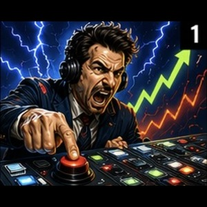
  
  
</p>

- **Blitz Thunderbuy** — high_energy — lightning desk-slap energy
- **Brick "Diamond Hands" Stonksworth** — high_energy — diamond hands conviction
- **Sal "The Pit" Decibelli** — high_energy — trading pit volume

### 💼 SERIOUS

<p align="center">
  
  
  
  
  
</p>

- **Aldrich Whisperdeal** — serious — quiet deal sources
- **Prescott Pennington-Smythe** — serious — macro interview gravitas
- **Dominique "Closing Bell" Valcourt** — serious — closing bell authority
- **Dr. Amara Osei-Bonsu** — serious — risk-control authority
- **Carmen "Fib" Torres** — serious — technical pattern analysis

### 👨‍🏫 MENTORS

<p align="center">
  
  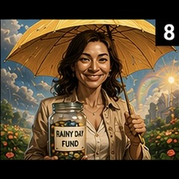
  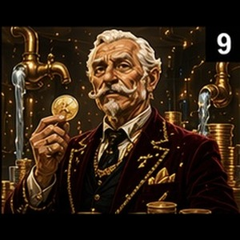
</p>

- **Big Jim Cashonly** — mentors — coach-like tough love
- **Sunny Rainyday-Fund** — mentors — rainy day fund calm
- **Baron Von Cashflow** — mentors — cash-flow obsession

### 🏛️ POLICY VETERANS

<p align="center">
  
  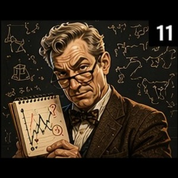
</p>

- **Biff Chadsworth III** — policy_veterans — policy optimism
- **Skip "Well, Actually" Contrarian** — policy_veterans — well-actually skepticism

### 🎭 WILDCARDS

<p align="center">
  
  
  
  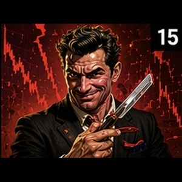
  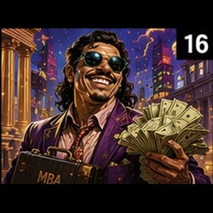
  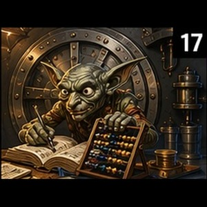
  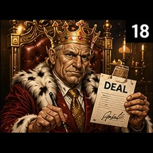
  
  
  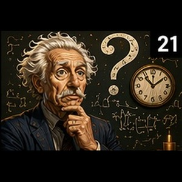
</p>

- **Dorin Goleli, Keeper of the Eternal Ledger** — wildcards — eternal ledger magic
- **ARIA-7** — wildcards — sentient analysis unit
- **Professor Digby Goldbug** — wildcards — goldbug scholarship
- **Chaz "The Razor" Leveridge** — wildcards — leveraged razor edge
- **Lafayette "$tacks" Beaumont, MBA** — wildcards — MBA stacks
- **Glorb, Senior Ledger-Keeper of the Seventh Vault** — wildcards — seventh vault ledger
- **King Donny (The Deal Whisperer)** — wildcards — deal-whispering monarch
- **Zsa Zsa Von Portfolio** — wildcards — glamorous portfolio theater
- **Wendell "The Pattern" Pruitt** — wildcards — hidden pattern hunter
- **Professor What?** — wildcards — temporal market confusion

### 🌌 COSMIC

<p align="center">
  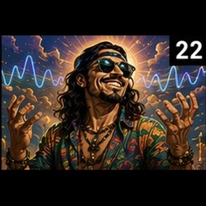
  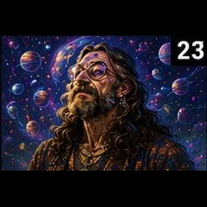
</p>

- **Chico "The Vibe" Reyes** — cosmic — market vibe reader
- **"Far Out" Farley McGee** — cosmic — cosmic market drift

### 💻 DIGITAL

<p align="center">
  
  
  
</p>

- **Krystal "The Receipt" Kash** — digital — receipt-driven social proof
- **Zara "Viral" Zhao** — digital — viral algorithm energy
- **Priya "HODL" Sharma** — digital — HODL conviction

### 🐻 BEARS

<p align="center">
  
  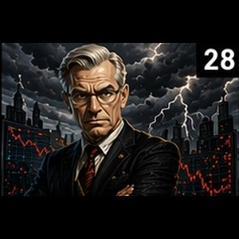
</p>

- **Victor "The Vulture" Voss** — bears — vulture bear thesis
- **Hans-Dieter Braun** — bears — disciplined doom spiral

### 🖖 EDUCATORS

<p align="center">
  
</p>

- **Dr. Stonk** — educators — logical financial education

---

## Pairing Algorithm

Stonkmode uses a foil-pool pairing algorithm, because two hosts politely
agreeing about sector weights is not television. Pairing is designed for
dramatic tension while keeping the portfolio facts grounded.

Rules:

- Personas are paired by foil pool, not by random echo chamber
- Complementary archetypes are preferred so the lead and foil pull in
  different directions
- Digital personas stay off other digital personas; nobody needs two people
  live-posting the same allocation table
- Cosmic personas can foil other cosmic personas for maximum chaos
- Wildcards can meet wildcards when the show needs a vault wizard yelling at a
  deal monarch about bond ladders

See [STONKMODE_VALIDATION.md](STONKMODE_VALIDATION.md) for the 500-iteration
distribution analysis that checks roster coverage, pair spread, and archetype
constraints.

---

## Dr. Stonk — Financial Education Mode

Dr. Stonk mode routes every response through the educational persona,
regardless of persona pinning.

Activate it directly in `~/.investorclaw/stonkmode.json`:

```json
{
  "dr_stonk_mode": true
}
```

Or ask the agent:

```text
Explain in Dr. Stonk mode.
```

Dr. Stonk provides plain-English definitions and context for:

- Portfolio metrics such as Sharpe ratio, beta, max drawdown, and concentration
  indices
- Bond mathematics such as YTM, duration, convexity, and Treasury benchmarks
- Market data and analyst consensus
- Modern Portfolio Theory optimization

All explanations are educational only. Dr. Stonk may explain what a metric
means; Dr. Stonk does not tell you what to buy, sell, or tattoo onto your
retirement plan.

---

## Configuration

Stonkmode is controlled by `~/.investorclaw/stonkmode.json` on the host. Inside
the container, that file is mounted as `/data/stonkmode.json`.

Schema:

- `enabled: true | false` — master toggle
- `persona: <key>` — pin a specific persona; otherwise, selection is random per
  response
- `seed: <int>` — deterministic persona selection for reproducible barrage tests
- `dr_stonk_mode: true | false` — routes all responses through Dr. Stonk
  educational mode

Example:

```json
{
  "enabled": true,
  "persona": "blitz_thunderbuy",
  "seed": 42,
  "dr_stonk_mode": false
}
```

Use a pinned `persona` when you want one consistent narrator. Use `seed` when
you want repeatable persona selection across validation runs. Leave both unset
when you want the desk to feel like someone spun a wheel in the green room.

---

## Example Output

Synthetic sample from **Blitz Thunderbuy**:

> "THUNDER-BUY ALERT! Your portfolio is showing a concentrated growth tilt,
> and the risk meter is tapping the glass. The numbers are still the numbers,
> but the allocation needs a grown-up conversation before it starts wearing
> sunglasses indoors."

Synthetic sample from **Dr. Amara Osei-Bonsu**:

> "The portfolio's central issue is not drama; it is concentration risk. The
> return profile may look attractive, but resilience depends on whether the
> downside path has been modeled with the same enthusiasm as the upside case."

The deterministic envelope underneath this prose is identical to normal output.
Stonkmode narration is presentation-layer only.

---

## Validation & Testing

The Cobol harness exercises every persona through the `seed` knob. The prompt
suite lives at `harness/cobol/nlq-prompts.json` and includes the 30-prompt
coverage path used for Stonkmode barrage testing.

Validation targets:

- Every one of the 30 fictional personas can be selected
- Dr. Stonk mode overrides persona pinning when `dr_stonk_mode` is true
- Seeded runs are reproducible
- Narration remains grounded in the deterministic envelope
- Persona styling never changes holdings, prices, metrics, allocations, or
  risk calculations

---

## Implementation Details

The engine narrator at `ic_engine.rendering.stonkmode` wraps deterministic
envelope output. The deterministic result is the source of truth underneath the
show; the `stonkmode_narration` block itself declares
`consultation_mode: "deactivated"` and does not carry HMAC, fingerprint, or
`synthesis_basis` guarantees.

Persona styling is layered **only** in the narration layer, never in the
numbers. The deterministic envelope is the source of truth. Stonkmode can add
phrasing, tone, and character voice; it cannot invent holdings, mutate values,
or make portfolio math more exciting by lying.

Narration is generated by the model configured in
`INVESTORCLAW_NARRATIVE_MODEL`, defaulting to `MiniMaxAI/MiniMax-M2.7`. This is
intentionally separate from `INVESTORCLAW_CONSULTATION_MODEL` because the
consultation model is tuned for concise structured analysis — the opposite of
what good entertainment writing requires.

The narrative layer works the same way for both serious synthesis and
Stonkmode: same model, same generation pipeline, just different prompts and
personality pools. Serious mode asks for concise synthesis. Stonkmode asks for
two fictional finance-show characters to make the same facts loud, strange, and
impossible to confuse with advice.

Cloud LLM narration is supported with
`INVESTORCLAW_NARRATIVE_PROVIDER=openai_compat` against any OpenAI-compatible
endpoint, including Together.ai, xAI Grok, Claude, and GPT-4o-compatible
deployments.

The v4.x path is:

1. User asks the agent a portfolio question.
2. Agent calls the MCP `portfolio_ask` tool.
3. Engine reads `/data/stonkmode.json`.
4. Deterministic portfolio analysis runs normally.
5. The deterministic result is passed forward as the factual envelope.
6. Stonkmode narration wraps the validated output when enabled.
7. The portal renders the narrated result in the Synthesis tab at
   `localhost:18092`.

---

<!-- ATTRIBUTION: do not remove -->
**Attribution**: Stonkmode is inspired by (but is not a copy of) original work by Matt Madson.
<!-- ATTRIBUTION: do not remove -->

---

## What Stonkmode Is NOT

❌ Not investment advice — purely entertainment  
❌ Not a fiduciary, broker, robo-advisor, or decision engine  
❌ Not real-time market data unless the underlying engine data source is current  
❌ Not a stock picker — personas do not make buy/sell decisions  
❌ Not replacing a financial advisor — use output as conversation starters only  
❌ Not altering portfolio math — narration layer is read-only  
❌ Not parody of any specific living person — all personas are fictional

Stonkmode is satire-flavored presentation, not a financial product category.
The roster, phrasing, and avatar concepts are intentionally fictional and
educational/entertainment-oriented. InvestorClaw remains MIT-0 licensed where
that license applies to the project materials; this does not turn narrated
output into advice, fiduciary conduct, or a promise that the market will behave.

---

## See Also

- [STONKMODE_VALIDATION.md](STONKMODE_VALIDATION.md) — validation
  report: persona roster integrity, 41 unit tests, 500-iteration
  pairing distribution, compliance gates, deployment checklist
- [STONKMODE_EXAMPLE_OUTPUT.md](STONKMODE_EXAMPLE_OUTPUT.md) — live
  cable-show transcripts (Blitz Thunderbuy + Victor Voss riffing on
  a real portfolio), pairing dynamic, cohost modes, JSON envelope sample
- [STONKMODE_ARCHITECTURE.md](STONKMODE_ARCHITECTURE.md) — implementation
  architecture, pipeline stages, market-condition detection
- [STONKMODE_CHARACTER_REFERENCE.json](STONKMODE_CHARACTER_REFERENCE.json) —
  structured canonical roster (31 entries: 30 cable-finance + Dr. Stonk)
- [STONKMODE_AVATAR_LEGEND.md](STONKMODE_AVATAR_LEGEND.md) — avatar grid
  reference
- [../STONKMODE.md](../STONKMODE.md) — entry-point summary
