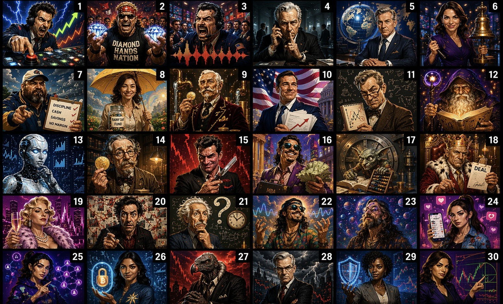

# Stonkmode — Entertainment Mode + Dr. Stonk Financial Education

**30 fictional cable TV finance personalities + educational mode**

---

## What is Stonkmode?

After serious portfolio analysis, enable **Stonkmode** for AI-generated
narrative commentary featuring 30 distinct fictional cable finance TV
personalities. Each persona has a unique voice, perspective, and comedic
flair, turning dry financial metrics into entertaining portfolio narratives.

**Stonkmode is entertainment, not advice.** Its existence is the clearest
signal that InvestorClaw is NOT institutional financial software. The math
underneath stays deterministic; the narration is the part wearing a loud tie.

In v4.x, Stonkmode runs through the containerized ic-engine flow. The portal
is available at `localhost:18092`, and narrated results appear in the
Synthesis tab when Stonkmode is enabled.

---

## Enable Stonkmode

Use the agent flow instead of legacy slash commands:

```text
User says: "Switch to stonkmode."
User says: "What's in my portfolio?"
```

The agent routes the request through the `portfolio_ask` MCP tool. The engine
flips state in `~/.investorclaw/stonkmode.json`, mounted inside the container
as `/data/stonkmode.json`. Subsequent `portfolio_ask` calls return
character-narrated responses while the deterministic engine output remains
unchanged underneath.

To disable:

```text
User says: "Switch to normal mode."
```

That uses the same `portfolio_ask` flow and clears the narration toggle for
subsequent calls.

Stonkmode wraps analysis output in character narration while preserving all
underlying financial rigor. All math stays deterministic Python. The LLM only
generates the entertaining framing.

---

## The 30 Personas

Stonkmode features 30 distinct fictional cable finance TV personalities
organized in the gallery below.

---

### Character Gallery

See [STONKMODE_AVATAR_LEGEND.md](STONKMODE_AVATAR_LEGEND.md) for the full
avatar legend.



---

### Dr. Stonk — The 31st Persona

**From the planet Hephaestus, Dr. Stonk is here for your logical financial
education.**

Dr. Stonk is the 31st persona: not another market host, but an educator mode
that explains financial concepts without pretending to be a fiduciary, a
robo-advisor, or a crystal ball with better branding.

---

### Avatar Assets

- **Container path**: `/opt/ic-engine/.venv/lib/python3.12/site-packages/ic_engine/assets/stonkmode-avatars/`
- **30 fictional personas**: SVG avatar assets
- **Dr. Stonk**: PNG avatar asset
- **Composite grid**: `docs/assets/stonkmode-avatars-grid.jpg`

---

## Persona Descriptions

### 🔥 HIGH ENERGY

- **Blitz Thunderbuy** — high_energy — lightning desk-slap energy
- **Brick "Diamond Hands" Stonksworth** — high_energy — diamond hands conviction
- **Sal "The Pit" Decibelli** — high_energy — trading pit volume

### 💼 SERIOUS

- **Aldrich Whisperdeal** — serious — quiet deal sources
- **Prescott Pennington-Smythe** — serious — macro interview gravitas
- **Dominique "Closing Bell" Valcourt** — serious — closing bell authority
- **Dr. Amara Osei-Bonsu** — serious — risk-control authority
- **Carmen "Fib" Torres** — serious — technical pattern analysis

### 👨‍🏫 MENTORS

- **Big Jim Cashonly** — mentors — coach-like tough love
- **Sunny Rainyday-Fund** — mentors — rainy day fund calm
- **Baron Von Cashflow** — mentors — cash-flow obsession

### 🏛️ POLICY VETERANS

- **Biff Chadsworth III** — policy_veterans — policy optimism
- **Skip "Well, Actually" Contrarian** — policy_veterans — well-actually skepticism

### 🎭 WILDCARDS

- **Dorin Goleli, Keeper of the Eternal Ledger** — wildcards — eternal ledger magic
- **ARIA-7** — wildcards — sentient analysis unit
- **Professor Digby Goldbug** — wildcards — goldbug scholarship
- **Chaz "The Razor" Leveridge** — wildcards — leveraged razor edge
- **Lafayette "$tacks" Beaumont, MBA** — wildcards — MBA stacks
- **Glorb, Senior Ledger-Keeper of the Seventh Vault** — wildcards — seventh vault ledger
- **King Donny (The Deal Whisperer)** — wildcards — deal-whispering monarch
- **Zsa Zsa Von Portfolio** — wildcards — glamorous portfolio theater
- **Wendell "The Pattern" Pruitt** — wildcards — hidden pattern hunter
- **Professor What?** — wildcards — temporal market confusion

### 🌌 COSMIC

- **Chico "The Vibe" Reyes** — cosmic — market vibe reader
- **"Far Out" Farley McGee** — cosmic — cosmic market drift

### 💻 DIGITAL

- **Krystal "The Receipt" Kash** — digital — receipt-driven social proof
- **Zara "Viral" Zhao** — digital — viral algorithm energy
- **Priya "HODL" Sharma** — digital — HODL conviction

### 🐻 BEARS

- **Victor "The Vulture" Voss** — bears — vulture bear thesis
- **Hans-Dieter Braun** — bears — disciplined doom spiral

### 🖖 EDUCATORS

- **Dr. Stonk** — educators — logical financial education

---

## Dr. Stonk — Financial Education Mode

Dr. Stonk mode routes every response through the educational persona,
regardless of persona pinning.

Activate it directly in `~/.investorclaw/stonkmode.json`:

```json
{
  "dr_stonk_mode": true
}
```

Or ask the agent:

```text
Explain in Dr. Stonk mode.
```

Dr. Stonk provides plain-English definitions and context for:

- Portfolio metrics such as Sharpe ratio, beta, max drawdown, and concentration
  indices
- Bond mathematics such as YTM, duration, convexity, and Treasury benchmarks
- Market data and analyst consensus
- Modern Portfolio Theory optimization

All explanations are educational only. Dr. Stonk may explain what a metric
means; Dr. Stonk does not tell you what to buy, sell, or tattoo onto your
retirement plan.

---

## Configuration

Stonkmode is controlled by `~/.investorclaw/stonkmode.json` on the host. Inside
the container, that file is mounted as `/data/stonkmode.json`.

Schema:

- `enabled: true | false` — master toggle
- `persona: <key>` — pin a specific persona; otherwise, selection is random per
  response
- `seed: <int>` — deterministic persona selection for reproducible barrage tests
- `dr_stonk_mode: true | false` — routes all responses through Dr. Stonk
  educational mode

Example:

```json
{
  "enabled": true,
  "persona": "blitz_thunderbuy",
  "seed": 42,
  "dr_stonk_mode": false
}
```

Use a pinned `persona` when you want one consistent narrator. Use `seed` when
you want repeatable persona selection across validation runs. Leave both unset
when you want the desk to feel like someone spun a wheel in the green room.

---

## Example Output

Synthetic sample from **Blitz Thunderbuy**:

> "THUNDER-BUY ALERT! Your portfolio is showing a concentrated growth tilt,
> and the risk meter is tapping the glass. The numbers are still the numbers,
> but the allocation needs a grown-up conversation before it starts wearing
> sunglasses indoors."

Synthetic sample from **Dr. Amara Osei-Bonsu**:

> "The portfolio's central issue is not drama; it is concentration risk. The
> return profile may look attractive, but resilience depends on whether the
> downside path has been modeled with the same enthusiasm as the upside case."

The deterministic envelope underneath this prose is identical to normal output.
Stonkmode narration is presentation-layer only.

---

## Validation & Testing

The Cobol harness exercises every persona through the `seed` knob. The prompt
suite lives at `harness/cobol/nlq-prompts.json` and includes the 30-prompt
coverage path used for Stonkmode barrage testing.

Validation targets:

- Every one of the 30 fictional personas can be selected
- Dr. Stonk mode overrides persona pinning when `dr_stonk_mode` is true
- Seeded runs are reproducible
- Narration remains grounded in the deterministic envelope
- Persona styling never changes holdings, prices, metrics, allocations, or
  risk calculations

---

## Implementation Details

The engine narrator at `ic_engine.rendering.stonkmode` wraps deterministic
envelope output. HMAC validation rejects fabricated metrics before narration is
accepted.

Persona styling is layered **only** in the narration layer, never in the
numbers. The signed envelope is the source of truth. Stonkmode can add phrasing,
tone, and character voice; it cannot invent holdings, mutate values, or make
portfolio math more exciting by lying.

The v4.x path is:

1. User asks the agent a portfolio question.
2. Agent calls the MCP `portfolio_ask` tool.
3. Engine reads `/data/stonkmode.json`.
4. Deterministic portfolio analysis runs normally.
5. Signed envelope validation gates the result.
6. Stonkmode narration wraps the validated output when enabled.
7. The portal renders the narrated result in the Synthesis tab at
   `localhost:18092`.

---

## What Stonkmode Is NOT

❌ Not investment advice — purely entertainment  
❌ Not a fiduciary, broker, robo-advisor, or decision engine  
❌ Not real-time market data unless the underlying engine data source is current  
❌ Not a stock picker — personas do not make buy/sell decisions  
❌ Not replacing a financial advisor — use output as conversation starters only  
❌ Not altering portfolio math — narration layer is read-only  
❌ Not parody of any specific living person — all personas are fictional

Stonkmode is satire-flavored presentation, not a financial product category.
The roster, phrasing, and avatar concepts are intentionally fictional and
educational/entertainment-oriented. InvestorClaw remains MIT-0 licensed where
that license applies to the project materials; this does not turn narrated
output into advice, fiduciary conduct, or a promise that the market will behave.

---

## See Also

- [STONKMODE_CHARACTER_REFERENCE.json](STONKMODE_CHARACTER_REFERENCE.json) —
  structured canonical roster
- [STONKMODE_ARCHITECTURE.md](STONKMODE_ARCHITECTURE.md) — implementation
  architecture
- [STONKMODE_AVATAR_LEGEND.md](STONKMODE_AVATAR_LEGEND.md) — avatar grid
  reference
- [../STONKMODE.md](../STONKMODE.md) — entry-point summary
